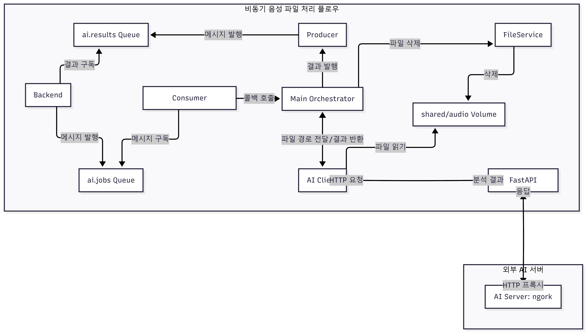

### FastAPI 레포지토리입니다.


> 해당 레포지토리는 AI 실행 환경과 서비스 백엔드를 분리하는 구조로 설계되었습니다. **AI Gateway** 는 서비스 백엔드와 AI 분석 서버 사이에서 AI 기능에 대한 단일 진입점 역할을 수행합니다.


>>>  자세한 내용은 기술 개발 문서 *FastAPI AI 서버 통신 설계*를 참고해주세요

## 🔗 기술 개발 문서
- [FastAPI란 무엇인가요?](https://www.notion.so/FastAPI-2f4fc74069a6806fa07bc9ffe2408998?source=copy_link)
- [FastAPI AI 서버 통신 설계](https://www.notion.so/FastAPI-AI-2eefc74069a68097a84aff96aeaf7eaa?source=copy_link)


## 📁 디렉토리 구조

```
ai-gateway/
├── app/
│   ├── main.py                # FastAPI 앱 + Main Orchestrator
│   ├── api/v1/
│   │   ├── routes.py          # API 라우터 (헬스체크, AI 프록시)
│   │   ├── health.py          # 헬스체크 엔드포인트
│   │   └── clients/
│   │       └── ai_client.py   # AI 서버 HTTP 통신
│   ├── messaging/
│   │   ├── rabbitmq.py        # RabbitMQ 연결 관리
│   │   ├── consumer.py        # 메시지 수신 & Consumer 생명주기
│   │   ├── producer.py        # 결과 발행
│   │   └── schemas.py         # 메시지 스키마 정의
│   ├── services/
│   │   └── file_service.py    # 파일 I/O (읽기, 파일 검증, 삭제)
│   └── core/
│       └── config.py          # 환경설정 관리
├── Dockerfile
└── requirements.txt
```
